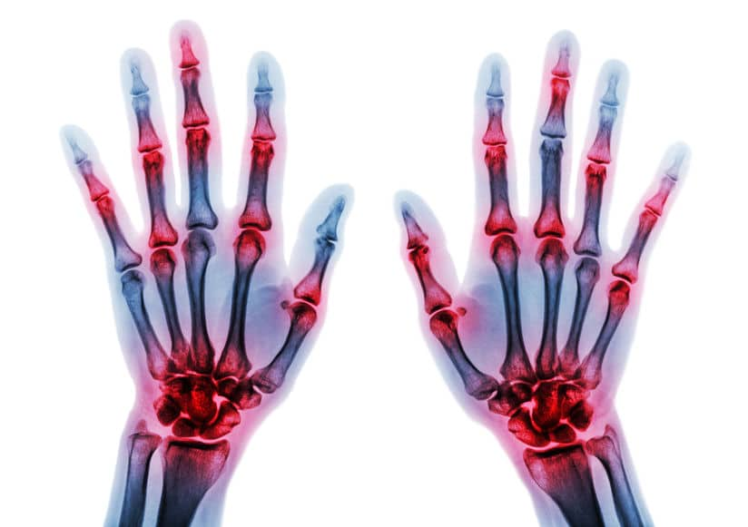

# J2P4_Transcriptomics

  

___

## Inleiding
Reuma inleiding, *+- 200 woorden met aanleiding, achtergrondinformatie en doelstel-
ling. Bronnen (PDF) kunnen in een aparte folder met verwijzing*

## Methode
*+- 200 woorden met methode, flowschema. Zie leerdoelen voor mi-
nimale inhoud. Scripts, data etc. kunnen in een aparte folder met verwijzing.*

## Resultaten
+- 200 woorden, inclusief correcte verwijzingen

## Conclusie
*+- 200 woorden, inclusief aanbevelingen en onderzoek in context
plaatsen*
