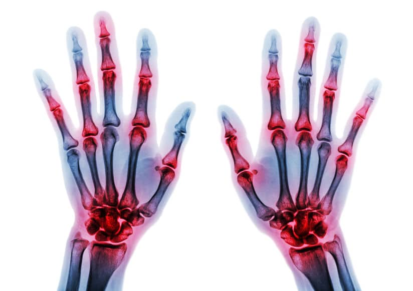
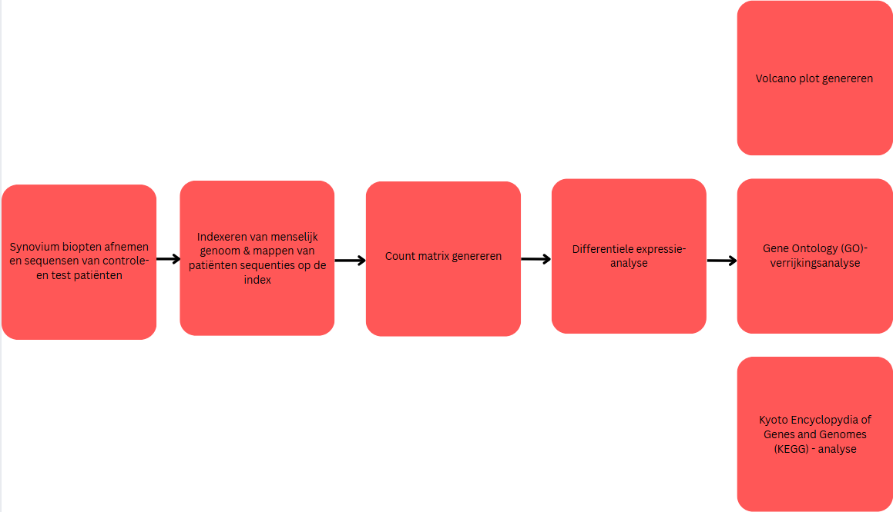

# Verhoging van CD28 op T-helpercellen gemeten in Reumatoïde artritis patiënten. 

  

___

## Inleiding
Reumatoïde artritis (RA) is een chronische ontstekingsziekte en auto-immuun ziekte. Het uit zich als een constante ontsteking van de gewrichtsvloeistof en erosie van de botten en kraakbeen, wat leidt tot de afbraak van de gewrichten [(Jahid et al., 2023)](Bronnen/(Jahid_et_al_2023).pdf).  De grootste oorzaak van reumatoïde artritis is genetisch, maar andere factoren zoals: geslacht, roken, BMI, alcoholconsumptie, dieet, en mondhygiëne verhogen ook de vatbaarheid voor RA [(Sparks, 2018)](Bronnen/(Sparks_2018).pdf).
Van alle test en controle patiënten is een synoviumbiopt genomen. De biopten werden gesequencet en geanalyseerd binnen R met als hoofddoel: “uitzoeken welke genen er hoger of lager tot expressie komen in personen met reumatoïde artritis”. Naast dit hoofddoel, werd er ook onderzocht welke metabolische route het meest betrokken was bij patiënten met RA met behulp van een Gene ontology analyses (GO).

  

## Methode
Tijdens dit onderzoek zijn 8 patiënten onderzocht. 4 patiënten die negatief getest zijn voor ACPA (anti-ccp), en 4 patiënten die positief getest waren en dus reumatoïde artritis hadden. Van deze patiënten waren sequenties van synoviumbiopten gegenereerd. Om de verkregen sequenties te analyseren, werd de data verwerkt binnen R. Om dit te doen werd er gebruik gemaakt van externe “packages”. Deze werden gedownload met “BiocManager” (V 1.30.26).
Voor het eerste gedeelte van het uitwerken waren de packages: “Rsubread” (V2.20.0) en “Rsamtools” (V2.22.0) nodig. Met deze packages werd een menselijk referentiegenoom geïndexeerd (hier te vinden), De patiënten sequenties werden op deze index gemapt en vervolgens werden de gemapde sequenties opgeslagen als “. BAM” en “. BAM.BAI” bestanden.
 Het volgende deel was een count matrix genereren. Hiervoor waren de packages: “Rsubread” (V2.20.0) en “readr” (V2.1.5) nodig. Een count matrix is een tabel waarin per gen staat hoeveel reads er op dat gen zijn gemapt. Om dit uit te voeren werden de gegenereerde. BAM bestanden vergeleken met een GTF-bestand van het menselijk genoom (hier te vinden).
Voor het laatste gedeelte werd er een statistische toets uitgevoerd (differentiële expressie analyse), KEGG-analyse, GO-analyse en volcano plot gegeneerd. Hiervoor waren de packages: “DESeq2” (V1.46.0), “KEGGREST” (V1.46.0), “readr” (V2.1.5), “dplyr”(V1.1.4), “goseq”(V1.58.0), “geneLenDataBase” (V1.42.0), org.Hs.eg.db” (V3.20.0), “GO.db” (V3.20.0), "ggplot2"(V3.5.2), “EnhancedVolcano” (V1.24.0) en “pathview” (V1.46.0) nodig. Aan de hand van deze analyses kon er onderscheid gemaakt worden tussen significante veranderingen binnen RA patiënten en kon er gemeten werden op welke metabole route RA het meest effect had.
Het volledige Rstudio code is [hier](Script/casus_Reuma_R_code.R) terug te vinden.

## Resultaten
Met behulp van R werden meerdere resultaten gegenereerd. Als eerst werd er een [volcano plot](Resultaten/volcano_plot.png) gegenereerd. Hiermee werd er gevisualiseerd hoeveel gemeten genen: niet significant zijn (grijs), alleen een log2-waarde hebben van 2 of -2 (groen) en hoeveel naast de gewenste log-waarde ook p-waarde onder 0.05 hebben (rood).
Hierna is een GO-analyse uitgevoerd. Hiermee kond er gemeten worden welke metabolische routes significant zijn aangepast binnen RA-patiënten. Uit deze analyse is een [top 10 grafiek](Resultaten/top_10_GO.png) gegenereerd van de metabolische routes, om te bepalen welke routes het meest significant zijn aangepast. 
Als laatste werd er een KEGG-analyse uitgevoerd. Bij een KEGG-analyse werden de significante genen met een log2-waarde boven de 2 of onder de -2 gemapt op een “pathway”. Tijdens het experiment is er gekozen voor de pathway “hsa04672”, wat het intestinaal immuun netwerk voor IgA-productie aantoont. De gegenereerde pathway [(hier)](Resultaten/hsa04672.png) toont rode (op gereguleerd) en groene (neer gereguleerd) genen. Hiermee is te zien dat er een duidelijk verschil is in genregulatie van patiënten met reumatoïde artritis.

## Conclusie
Dit experiment werd uitgevoerd met als doel: uitzoeken welke genen er hoger of lager tot expressie komen in personen met reumatoïde artritis. In de KEGG-pathway is te zien dat de “T-cell receptor signaling pathway” opgereguleerd is. Specifiek het gen CD28+ op CD4-cellen (T-helpercellen), wat een grote rol speelt bij T-celactivatie. Uit eerdere onderzoek is gevonden dat een verhoogde klonale expansie van CD4+ CD28- T-cellen vaak wordt gevonden in patiënten met RA. [(Pawlik et al., 2003)](Bronnen/(Pawlik_et_al_2003).pdf)
Ook werd er een deelvraag gesteld: welke metabolische route het meest betrokken is bij patiënten met RA? Aan de hand van een GO-analyse is dit berekent. Binnen deze grafiek is een top 10 gegenereerd. Hierin is te zien dat het “immunoglobulinecomplex” het meest significant was aangepast binnen patiënten met RA.
